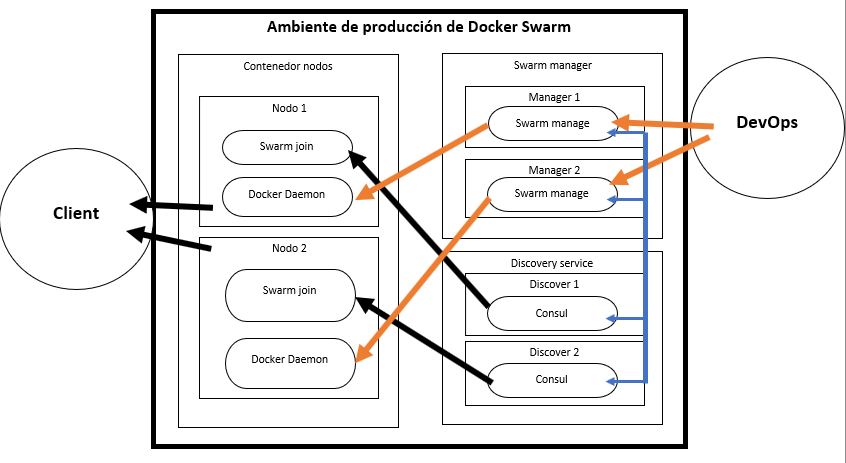
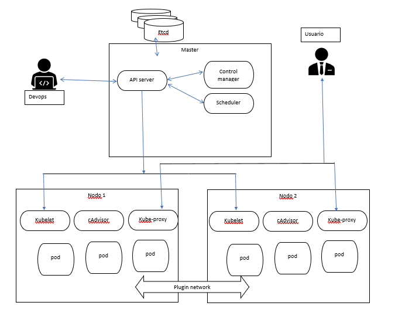
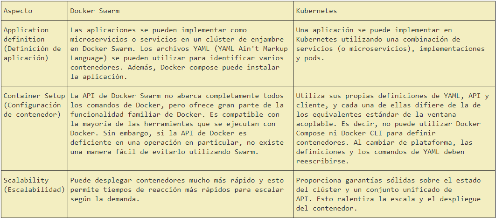
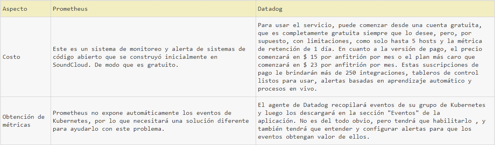
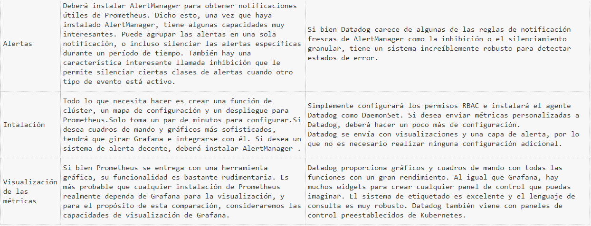

# Proyecto Final Sistemas Distribuidos
### Este documento contiene la resolución del proyecto final del curso de Sistemas Distribuidos, para el periodo 2019-1.
#### Realizado por:
**Nombre:** Santiago  
**Apellidos:** Fajardo Sima  
**Correo:** santiago_fajardo96@hotmail.com  
**Tema:** Orquestación de Contenedores  

### Objetivos
* Realizar de forma autónoma el aprovisionamiento automático de infraestructura
* Diagnosticar y ejecutar de forma autónoma las acciones necesarias para lograr infraestructuras estables
* Integrar servicios ejecutándose en nodos distintos

### Prerrequisitos
* Conocimientos teórico-prácticos en orquestación de contenedores
* Conocimientos en monitoreo de aplicaciones

### Descripción
Responder las preguntas acerca de orquestación de contenedores

### Actividades
* Realice un gráfico donde muestre la arquitectura de docker swarm y kubernetes. Tenga en cuenta
Incluya aspectos como las tecnologías empleadas para la comunicación de sus elementos, descubrimiento de servicio, entre otros.  
* Crear una tabla comparativa con al menos 5 diferencias entre Docker Swarm y Kubernetes
* Mencione las tecnologías de orquestación de contenedores nativas con kubernetes para al menos tres proveedores de servicios en la nube. Describa sus principales características y limitaciones
* Describa las implicaciones a nivel de operaciones de emplear una solución de kubernetes nativa con respecto a desplegar kubernetes manualmente a través de scripts, por ejemplo: KOPS. Tenga en cuenta
aspectos de costo y tolerancia a fallas.
* Crear una tabla comparativa con al menos 5 diferencias entre el monitoreo con Datadog y el monitoreo con Prometheus. Incluya aspectos como costo, obtención de métricas, alertas, entre otros.  

### Solución
**Docker swarm architecture**  

1. Docker Daemon: es un servicio que se ejecuta en su sistema operativo host . 

2. Swarm Join: un proceso que controla el registro de un único host con un Service Discovery Manager y la exposición del Docker Daemon del host como un servicio disponible.

3. Swarm Node: máquinas físicas o virtuales que ejecutan Docker Engine 1.12 o posterior en modo de enjambre.

4. Swarm Manager: el servicio que un usuario usa para administrar contenedores en los nodos de Swarm registrados. Este es el punto final para interactuar con un entorno de Swarm.

5. Gestores de descubrimiento de servicios:Estos administradores rastrean los servicios, miembros y sesiones registrados entre réplicas de ellos mismos. 

  
6. Docker Compose: esta es una herramienta para definir y ejecutar aplicaciones Docker de múltiples contenedores. Esta herramienta toma un archivo yml de configuración simple y despliega los contenedores como un manifiesto. Es la herramienta de implementación para utilizar las nuevas funciones de red de host múltiple que permiten a los nodos de Swarm tener aplicaciones que se ejecutan en hosts distribuidos. Compose también maneja estrategias de colocación para asegurar que sus contenedores se distribuyan de manera uniforme (o no) a través de los Nodos de Swarm. Esto permite la redundancia de contenedores en el nivel de host, lo que es bueno para la capacidad de recuperación de la producción.  

**Kubernetes architecture**  

1. ETCD: es un almacén de valores clave coherente y de alta disponibilidad que se utiliza como almacén de respaldo de Kubernetes para todos los datos del clúster.

2. Pods:es un grupo de contenedores que se implementan juntos en el mismo host.

3. Hubelet:es el "agente de nodo" primario que se ejecuta en cada nodo, garantiza que los contenedores descritos en esos PodSpecs estén funcionando y en buen estado.

4. Api server:valida y configura datos para los objetos de API que incluyen pods, servicios, controladores de replicación y otros. El servidor API realiza las operaciones REST y proporciona la interfaz al estado compartido del clúster a través del cual interactúan todos los demás componentes.

5. Scheduler:es una función de carga de trabajo rica en políticas, con reconocimiento de topología y que afecta significativamente la disponibilidad, el rendimiento y la capacidad.

6. Controller manager:es un demonio que integra los bucles de control del núcleo enviados con Kubernetes. Vigila el estado compartido del clúster a través del apiserver y realiza cambios intentando mover el estado actual hacia el estado deseado.

7. cAdvisor:es un agente de análisis de rendimiento y uso de recursos de contenedor de código abierto.

8. Kube-proxy: Esto refleja los servicios tal como se definen en la API de Kubernetes en cada nodo.

9. Plugin network: Usaremos de ejemplo kubenet que es un complemento de red muy básico y simple, solo para Linux. Kubenet crea un puente de Linux y crea un par de veth para cada pod con el extremo del host de cada par conectado.

**Tabla comparativa Docker Swarm vs Kubernetes**  

**Conclusion**  
Kubernetes soporta mayores demandas con mayor complejidad, mientras que Docker Swarm ofrece una solución simple con la que se puede comenzar rápidamente. Docker Swarm ha sido bastante popular entre los desarrolladores que prefieren las implementaciones rápidas y la simplicidad. Al mismo tiempo, Kubernetes se utiliza en entornos de producción por varias empresas de Internet de alto perfil que ejecutan servicios populares.  

Tanto Kubernetes como Docker Swarm pueden ejecutar muchos de los mismos servicios, pero pueden necesitar enfoques ligeramente diferentes para ciertos detalles. Por lo tanto, al aprender Kubernetes y Docker y compararlos para varias características, puede tomar una decisión sobre la elección de la herramienta adecuada para su organización de contenedores.
### Tabla comparativa Datadog vs Prometheus  
  
  
**Conlusiones**  
En general, Datadog es un poco más fácil de instalar que Prometheus. Sin embargo, tampoco es demasiado difícil.
Grafana y Datadog son muy similares en sus capacidades de visualización. Ambos tienen todas las características que necesita para comenzar y le permiten armar paneles que lo ayudarán a monitorear su clúster Kubernetes.
Puede manipular la configuración de Prometheus para exponer los eventos de Kubernetes, pero la solución no es óptima. Datadog tiene un método soportado oficialmente para hacer esto. Sin embargo, la interfaz de usuario de Datadog para ver eventos deja mucho que desear.
El servicio que seleccione dependerá de su caso de uso. Si desea tener un control estricto sobre qué alertas se envían a su equipo, Prometheus y AlertManager son probablemente su mejor apuesta.
Tanto Prometheus como Datadog son soluciones de monitoreo robustas y con todas las funciones. Sin embargo, requieren una configuración extensa para obtener el máximo beneficio de la supervisión. 
