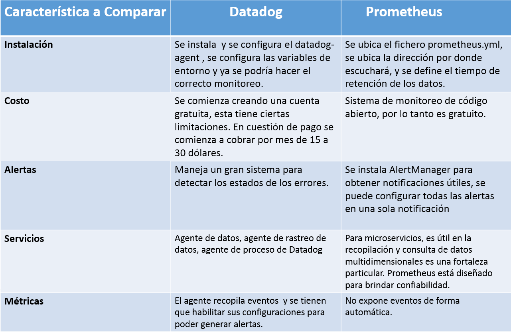

## Miniproyecto Sistemas Distribuidos

**Universidad ICESI**  
**Curso:** Sistemas Distribuidos  
**Nombre:** Julián Niño 
**Tema:**  Orquestación de Contenedores  
**Correo:** juliannino01@hotmail.com

### Objetivos
* Realizar de forma autónoma el aprovisionamiento automático de infraestructura
* Diagnosticar y ejecutar de forma autónoma las acciones necesarias para lograr infraestructuras estables
* Integrar servicios ejecutándose en nodos distintos

### Actividades

### Primer Punto

* Realice un gráfico donde muestre la arquitectura de docker swarm y kubernetes. Tenga en cuenta
Incluya aspectos como las tecnologías empleadas para la comunicación de sus elementos, descubrimiento de servicio, entre otros

 

**API server:** Es el que expone la API de kubernetes, se utiliza como punto de entrada de los comandos REST para controlar el cluster. Además, procesa valida y ejecuta todas las solicitudes REST.

**Scheduler:** Observa los pods recién creados que no registran un nodo asignado y selecciona un nodo para que estos se puedan  ejecutar. Tambien tiene las siguientes funciones:

       -Tiene en cuenta los recursos disponibles en cada nodo del clúster.
       -Toma en cuenta los recursos necesarios para que se ejecute un determinado servicio.

Lo anterior sirve para saber dónde desplegar cada pod dentro del clúster.

**Controller-manager:** Se encarga de ejecutar los controladores, un ejemplo de esto es el controlador de replicación encargado de mantener la cantidad correcta de pods en el clúster. 

**etcd:** Es un almacén de datos clave de valor simple, distribuido y consistente. Sus principales funciones son:

          -Almacenar la configuración compartida del clúster y para el descubrimiento de servicios
          -Notificar al resto de nodos del clúster los cambios de configuración

**kubelet:** Es el servicio dentro de cada nodo worker que sirve para comunicarse con el nodo master. Tambien  garantiza que los contenedores descritos en dicha configuración estén arriba y funcionando correctamente.

**Pods:** Un pod es grupo de uno o más contenedores y una especificación sobre cómo ejecutar los contenedores.

**kube-proxy:** Es un proxy de red y balnaceador de carga enrutando el trafico hacia el contenedor correcto, teniendo en cuenta la dirección IP y el numero de puerto. 

 

**Swarm Master:** Es el responsable del todo el cluster y gestiona los recursos de los hosts.

**Swarm Nodes:** Estos nodos deben ser accesibles por el nodo  master e integran un agente de nodo que registra el demonio del Docker referenciado, supervisa y actualizan el backend con el estado del nodo.

**Swarm Discovery:** Un servicio de descubrimiento que se basa en Docker Hub, utulizando un token para descubrir los nodos que forman parte de un cluster, tambien soporta servicios como consul y etcd.

###Segundo  Punto

* Crear una tabla comparativa con al menos 5 diferencias entre Docker Swarm y Kubernetes

 

###Tercer Punto

* Mencione las tecnologías de orquestación de contenedores nativas con kubernetes para al menos tres proveedores de servicios en la nube. Describa sus principales características y limitaciones

**IBM Cloud Kubernetes Service**

Esta ofrece herramientas eficientes, una experiencia de usuario intuitiva y una seguridad incorporada para la rápida entrega de aplicaciones que se pueden enlazar a servicios de nube relacionados con IBM Watson®, IoT, DevOps y análisis de datos. Entre las más importantes caracteristicas se encuentran: 

       - Gestión simplificada de clústeres: Proporciona una experiencia de GUI intuitiva para los usuarios de primera vez
       - La seguridad y el aislamiento se incorporan, no se anexan:  Almacene imágenes de Docker en un registro cifrado y privado, e incluya la firma de imágenes con Docker Notary y la aplicación de seguridad de imagen.
       - Servicios de nube y Watson en sus manos: Cree experiencias de cliente enriquecidas, con más de 170 servicios de IBM y de terceros para enriquecer sus aplicaciones, incluyendo datos cognitivos y meteorológicos.

Entre las limitaciones se encuentran: 

       - Los entornos de programación (lenguajes, librerías, etc.) están límitados por el proveedor
       - Al cobrarse por tiempo de ejecución, y en algunos proveedores limitarse, se penaliza un consumo prologando en el tiempo
       
 **Cloud Code**
 Ayuda al usuario cuando comienza a trabajar con un conjunto actualizado de muestras de Kubernetes preconfiguradas para la depuración, la creación y la implementación.
 
Entre las caracteristicas se encuentran: 

       -Cloud Code está diseñado específicamente para trabajar con Kubernetes, independientemente de su proveedor.
       -Cloud Code proporciona plantillas y resaltado de errores para los archivos de Kubernetes yaml
       -Cloud Code se integra fácilmente con las herramientas y servicios de DevOps existentes, incluidos Cloud Build y Stackdriver

* Describa las implicaciones a nivel de operaciones de emplear una solución de kubernetes nativa con respecto a desplegar kubernetes manualmente a través de scripts, por ejemplo: KOPS. Tenga en cuenta
aspectos de costo y tolerancia a fallas.

* Crear una tabla comparativa con al menos 5 diferencias entre el monitoreo con Datadog y el monitoreo con Prometheus. Incluya aspectos como costo, obtención de métricas, alertas, entre otros

 

### Referencias
* https://cloud.google.com/
* https://azure.microsoft.com/en-us/
* https://aws.amazon.com/
* https://aprenderdevops.com/arquitectura-de-kubernetes/
* https://www.adictosaltrabajo.com/2015/12/03/docker-compose-machine-y-swarm/
* https://creadoresdigitales.com/monitoreo-de-sistemas-con-prometheus/
* https://www.datadoghq.com/
* https://hackernoon.com/kubernetes-vs-docker-swarm-a-complete-comparison-guide-15ba3ac6f750
