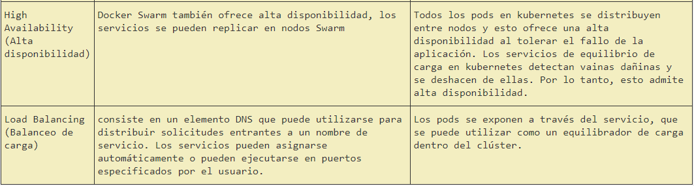

# Proyecto Final Sistemas Distribuidos
### Este documento contiene la resolución del proyecto final del curso de Sistemas Distribuidos, para el periodo 2019-1.
#### Realizado por:
**Nombre:** Santiago  
**Apellidos:** Fajardo Sima  
**Correo:** santiago_fajardo96@hotmail.com  
**Tema:** Orquestación de Contenedores  

### Objetivos
* Realizar de forma autónoma el aprovisionamiento automático de infraestructura
* Diagnosticar y ejecutar de forma autónoma las acciones necesarias para lograr infraestructuras estables
* Integrar servicios ejecutándose en nodos distintos

### Prerrequisitos
* Conocimientos teórico-prácticos en orquestación de contenedores
* Conocimientos en monitoreo de aplicaciones

### Descripción
Responder las preguntas acerca de orquestación de contenedores

### Actividades
* Realice un gráfico donde muestre la arquitectura de docker swarm y kubernetes. Tenga en cuenta
Incluya aspectos como las tecnologías empleadas para la comunicación de sus elementos, descubrimiento de servicio, entre otros.  
* Crear una tabla comparativa con al menos 5 diferencias entre Docker Swarm y Kubernetes
* Mencione las tecnologías de orquestación de contenedores nativas con kubernetes para al menos tres proveedores de servicios en la nube. Describa sus principales características y limitaciones
* Describa las implicaciones a nivel de operaciones de emplear una solución de kubernetes nativa con respecto a desplegar kubernetes manualmente a través de scripts, por ejemplo: KOPS. Tenga en cuenta
aspectos de costo y tolerancia a fallas.
* Crear una tabla comparativa con al menos 5 diferencias entre el monitoreo con Datadog y el monitoreo con Prometheus. Incluya aspectos como costo, obtención de métricas, alertas, entre otros.  

### Solución
**Docker swarm architecture**  

1. Docker Daemon: es un servicio que se ejecuta en su sistema operativo host . 

2. Swarm Join: un proceso que controla el registro de un único host con un Service Discovery Manager y la exposición del Docker Daemon del host como un servicio disponible.

3. Swarm Node: máquinas físicas o virtuales que ejecutan Docker Engine 1.12 o posterior en modo de enjambre.

4. Swarm Manager: el servicio que un usuario usa para administrar contenedores en los nodos de Swarm registrados. Este es el punto final para interactuar con un entorno de Swarm.

5. Gestores de descubrimiento de servicios:Estos administradores rastrean los servicios, miembros y sesiones registrados entre réplicas de ellos mismos. 

  
6. Docker Compose: esta es una herramienta para definir y ejecutar aplicaciones Docker de múltiples contenedores. Esta herramienta toma un archivo yml de configuración simple y despliega los contenedores como un manifiesto. Es la herramienta de implementación para utilizar las nuevas funciones de red de host múltiple que permiten a los nodos de Swarm tener aplicaciones que se ejecutan en hosts distribuidos. Compose también maneja estrategias de colocación para asegurar que sus contenedores se distribuyan de manera uniforme (o no) a través de los Nodos de Swarm. Esto permite la redundancia de contenedores en el nivel de host, lo que es bueno para la capacidad de recuperación de la producción.  

**Kubernetes architecture**  

1. ETCD: es un almacén de valores clave coherente y de alta disponibilidad que se utiliza como almacén de respaldo de Kubernetes para todos los datos del clúster.

2. Pods:es un grupo de contenedores que se implementan juntos en el mismo host.

3. Hubelet:es el "agente de nodo" primario que se ejecuta en cada nodo, garantiza que los contenedores descritos en esos PodSpecs estén funcionando y en buen estado.

4. Api server:valida y configura datos para los objetos de API que incluyen pods, servicios, controladores de replicación y otros. El servidor API realiza las operaciones REST y proporciona la interfaz al estado compartido del clúster a través del cual interactúan todos los demás componentes.

5. Scheduler:es una función de carga de trabajo rica en políticas, con reconocimiento de topología y que afecta significativamente la disponibilidad, el rendimiento y la capacidad.

6. Controller manager:es un demonio que integra los bucles de control del núcleo enviados con Kubernetes. Vigila el estado compartido del clúster a través del apiserver y realiza cambios intentando mover el estado actual hacia el estado deseado.

7. cAdvisor:es un agente de análisis de rendimiento y uso de recursos de contenedor de código abierto.

8. Kube-proxy: Esto refleja los servicios tal como se definen en la API de Kubernetes en cada nodo.

9. Plugin network: Usaremos de ejemplo kubenet que es un complemento de red muy básico y simple, solo para Linux. Kubenet crea un puente de Linux y crea un par de veth para cada pod con el extremo del host de cada par conectado.

**Tabla comparativa Docker Swarm vs Kubernetes**  

**Conclusion**  
Kubernetes soporta mayores demandas con mayor complejidad, mientras que Docker Swarm ofrece una solución simple con la que se puede comenzar rápidamente. Docker Swarm ha sido bastante popular entre los desarrolladores que prefieren las implementaciones rápidas y la simplicidad. Al mismo tiempo, Kubernetes se utiliza en entornos de producción por varias empresas de Internet de alto perfil que ejecutan servicios populares.  

Tanto Kubernetes como Docker Swarm pueden ejecutar muchos de los mismos servicios, pero pueden necesitar enfoques ligeramente diferentes para ciertos detalles. Por lo tanto, al aprender Kubernetes y Docker y compararlos para varias características, puede tomar una decisión sobre la elección de la herramienta adecuada para su organización de contenedores.  

### Empresas usando kubernetes de forma nativa  
  
Después de ocho años de existencia, Pinterest se había convertido en 1.000 microservicios y múltiples capas de infraestructura y diversas herramientas y plataformas de configuración. En 2016, la empresa lanzó una hoja de ruta hacia una nueva plataforma informática, liderada por la visión de crear el camino más rápido desde una idea hasta la producción, sin que los ingenieros se preocupen por la infraestructura subyacente.
La primera fase involucró el traslado de servicios a contenedores Docker. Una vez que estos servicios entraron en producción a principios de 2017, el equipo comenzó a analizar la orquestación para ayudar a crear eficiencias y administrarlas de manera descentralizada. Después de una evaluación de varias soluciones, Pinterest fue con Kubernetes.
"Al mudarse a Kubernetes, el equipo pudo desarrollar políticas de escalamiento bajo demanda y nuevas de conmutación por error, además de simplificar la implementación y la administración generales de una infraestructura complicada como Jenkins", dice Micheal Benedict, Gerente de Producto para la Nube y el grupo de infraestructura de datos en Pinterest. "No solo vimos tiempos reducidos de construcción, sino también enormes ganancias de eficiencia. Por ejemplo, el equipo recuperó más del 80 por ciento de la capacidad durante las horas no pico. Como resultado, el grupo de Jenkins Kubernetes ahora usa 30 por ciento menos de horas de instancia por día. en comparación con el clúster estático anterior ".  
"No solo vimos tiempos reducidos de construcción, sino también enormes ganancias de eficiencia. Por ejemplo, el equipo reclamó más del 80 por ciento de la capacidad durante las horas no pico. Como resultado, el clúster de Jenkins Kubernetes ahora usa un 30 por ciento menos horas por día en comparación con el clúster estático anterior ".  
  
El administrador de activos más grande del mundo, BlackRock , opera un esquema de implementación estática muy controlado, que ha permitido la escalabilidad a lo largo de los años. Pero en su división de ciencia de datos, se necesitaba un acceso más dinámico a los recursos."Tenemos entornos existentes que hacen estas cosas, pero necesitábamos hacerlo real, expansivo y escalable. Ser capaz de hacer girar eso a pedido, derribarlo, hacerlo mucho más dinámico."
A partir de lo aprendido durante un piloto que se realizó el año pasado usando Docker ambientes, Francisco se reunió un equipo para construir una aplicación web mediante la investigación de los inversores Kubernetes con el objetivo de conseguir la mejor producción dentro de un trimestre.
 "Administramos grandes procesos de clúster en las máquinas, por lo que hacemos una gran cantidad de orquestación y administración para nuestros principales procesos de producción de una manera que es muy nublada en concepto. Podemos administrarlos en un esquema de implementación estático y muy controlado, y eso nos ha dado una enorme cantidad de escalabilidad ", Director Gerente Michael Francis.Aunque eso funciona bien para la producción principal, la compañía ha encontrado que algunas cargas de trabajo de ciencia de datos requieren un acceso más dinámico a los recursos."Queremos poder dar a cada inversor acceso a la ciencia de datos, es decir, a los portátiles Python , o incluso a algo mucho más avanzado, como un motor MapReduce basado en Spark ", dice Francis. Pero "administrar instalaciones complejas de Python en los escritorios de los usuarios es realmente difícil porque todos terminan con entornos ligeramente diferentes. "Se puede pensar en Aladdin como una nube de servicios con API entre ellos que nos permite crear aplicaciones rápidamente", dice Francis. "Todo está en un bus de mensajes patentado, lo que nos brinda todo tipo de ventajas, pero al mismo tiempo." "Los componentes de la infraestructura central de Kubernetes están enganchados en nuestro marco de orquestación existente, lo que significa que cualquiera en nuestro equipo de soporte tiene tanto control como visibilidad del clúster utilizando las herramientas operativas existentes. Eso significa que no necesito contratar a más personas. ""Mi mensaje a otras empresas como nosotros es que realmente puedes integrar Kubernetes en una maquinaria existente y bien orquestada. No tienes que desechar todo lo que haces."  
  
 El subastador en línea eBay se fundó un año después de Amazon y es más antiguo que Google, Facebook y muchos otros hiperescalers. Al igual que sus pares, la gran cantidad de usuarios en su servicio (tiene 159 millones de compradores activos en 190 países y más de 800 millones de listados de productos en su servicio) y la escala de infraestructura necesaria para respaldarlos obliga a eBay a adoptar nuevas tecnologías antes de Empresas más conservadoras y pequeñas.OpenStack se encuentra entre los servidores y los anuncios de almacenamiento resumen los servicios de computación, almacenamiento y redes de los que dependen todos los servicios de la plataforma de eBay. En este momento, el sistema actual de eBay exige que cada instancia de aplicación se ejecute en su propia máquina virtual dedicada. La adopción de Kubernetes en eBay no se trata solo de cambiar a contenedores para implementar aplicaciones, sino de cambiar el ciclo de vida de la aplicación en la empresa, que se centra en la capa de la nube en la infraestructura (con las funciones clave de aprovisionamiento, implementación, monitoreo y remediación). desarrolladores y administradores de sistemas para realizar). eBay planea ir a un modelo de implementación más flexible utilizando contenedores como su tiempo de ejecución y Kubernetes en la parte superior de OpenStack para administrar esos contenedores.La programación estática de nodos en los clusters obviamente no es una situación ideal, pero muchas empresas que tienen grandes picos en el uso de partes de sus aplicaciones asignan la capacidad de forma estática en sus nubes privadas de la misma manera. "Este es un gran problema en una nube privada donde los servicios están apuntando, y no podemos explotar en una nube pública cuando necesitamos capacidad", explica Raveendran. "Tenemos que maximizar los recursos que tenemos".Pero una de las razones por las que las tecnologías como Kubernetes y Mesosphere están despertando mucho interés es que imponen una sobrecarga mucho menor en los servidores cuando se comparten múltiples cargas de trabajo en una sola máquina y, lo que es más importante, los contenedores con cargas de trabajo escalables pueden ser se encendió y se retiró a un ritmo mucho más rápido que la virtualización de servidores tradicional.Las cosas que hacen que Kubernetes atraiga a eBay, explica Raveendran, es que es un software de código abierto en el que muchas personas están colaborando y que eBay puede contribuir y beneficiarse. Quizás lo más importante es que Kubernetes está disponible como una capa de control en varias nubes públicas que ejecutan contenedores Docker, lo que le daría a eBay la capacidad de explotar en una nube pública en caso de que fuera necesario y la carga de trabajo se pueda cambiar de la nube privada distribuida de eBay a una nube pública .
 ### Tabla comparativa Datadog vs Prometheus  
  
  
**Conlusiones**  
En general, Datadog es un poco más fácil de instalar que Prometheus. Sin embargo, tampoco es demasiado difícil.
Grafana y Datadog son muy similares en sus capacidades de visualización. Ambos tienen todas las características que necesita para comenzar y le permiten armar paneles que lo ayudarán a monitorear su clúster Kubernetes.
Puede manipular la configuración de Prometheus para exponer los eventos de Kubernetes, pero la solución no es óptima. Datadog tiene un método soportado oficialmente para hacer esto. Sin embargo, la interfaz de usuario de Datadog para ver eventos deja mucho que desear.
El servicio que seleccione dependerá de su caso de uso. Si desea tener un control estricto sobre qué alertas se envían a su equipo, Prometheus y AlertManager son probablemente su mejor apuesta.
Tanto Prometheus como Datadog son soluciones de monitoreo robustas y con todas las funciones. Sin embargo, requieren una configuración extensa para obtener el máximo beneficio de la supervisión. 
